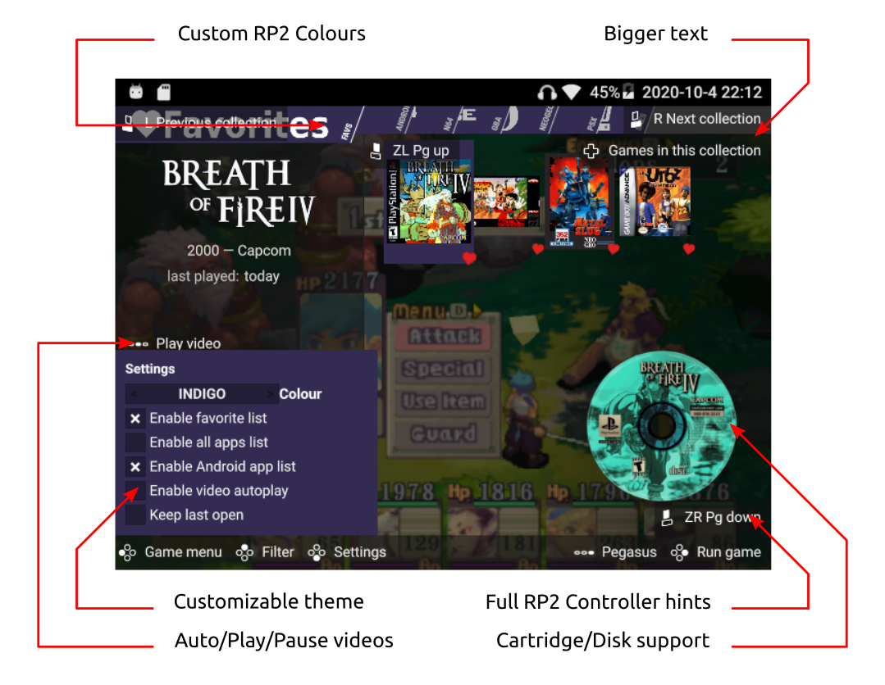

# Pegasus Grid theme for Retroid Pocket 2

## Installation

just [download](https://github.com/DFOXpro/rp2-pegasus-theme-grid/archive/master.zip) and extract it to your [theme directory](http://pegasus-frontend.org/docs/user-guide/installing-themes). You can then select the theme in the settings menu of Pegasus.

## Features extras to default theme
* Customizable theme
* Various colours to fit your rp2
* Favorites/All apps/Last plated lists to enable
* Android apps toggleable on the fly (if settings > sources > Adroid apps is enable)
* Game video can be play/paused with select and set in autoplay mode
* Support skrapper generic "support"(aka cartridge and disk) and "screen-title" images
  * (20/10/09 New) Option to hide support image available
* A11y changes:
  * Better contrasts
  * Bigger/Unified font-text
  * (20/10/09 New) Bigger icons/boxes, option to keep legacy "small" grid
  * Full controller hint (via Joystick move)
  * Game description in game menu for better legibility
  * (20/10/09 New) Subtle changes on various sizes for better legibility

## License

